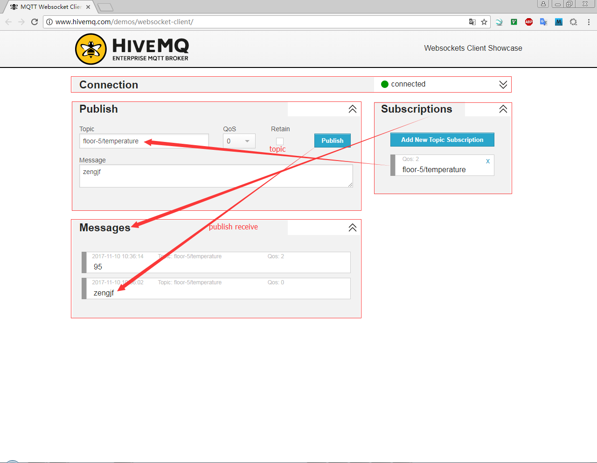

# mosquitto guide

## 参考文档

* [MQTT入门篇](http://dataguild.org/?p=6817)
* [MQTT进阶篇](http://dataguild.org/?p=6846)

## mosquitto_sub help

```
root@localhost:~/mqtt# mosquitto_sub --help
mosquitto_sub is a simple mqtt client that will subscribe to a single topic and print all messages it receives.
mosquitto_sub version 1.4.8 running on libmosquitto 1.4.8.

Usage: mosquitto_sub [-c] [-h host] [-k keepalive] [-p port] [-q qos] [-R] -t topic ...
                     [-C msg_count] [-T filter_out]
                     [-A bind_address] [-S]
                     [-i id] [-I id_prefix]
                     [-d] [-N] [--quiet] [-v]
                     [-u username [-P password]]
                     [--will-topic [--will-payload payload] [--will-qos qos] [--will-retain]]
                     [{--cafile file | --capath dir} [--cert file] [--key file]
                      [--ciphers ciphers] [--insecure]]
                     [--psk hex-key --psk-identity identity [--ciphers ciphers]]
                     [--proxy socks-url]
       mosquitto_sub --help

 -A : bind the outgoing socket to this host/ip address. Use to control which interface
      the client communicates over.
 -c : disable 'clean session' (store subscription and pending messages when client disconnects).
 -C : disconnect and exit after receiving the 'msg_count' messages.
 -d : enable debug messages.
 -h : mqtt host to connect to. Defaults to localhost.
 -i : id to use for this client. Defaults to mosquitto_sub_ appended with the process id.
 -I : define the client id as id_prefix appended with the process id. Useful for when the
      broker is using the clientid_prefixes option.
 -k : keep alive in seconds for this client. Defaults to 60.
 -N : do not add an end of line character when printing the payload.
 -p : network port to connect to. Defaults to 1883.
 -P : provide a password (requires MQTT 3.1 broker)
 -q : quality of service level to use for the subscription. Defaults to 0.
 -R : do not print stale messages (those with retain set).
 -S : use SRV lookups to determine which host to connect to.
 -t : mqtt topic to subscribe to. May be repeated multiple times.
 -T : topic string to filter out of results. May be repeated.
 -u : provide a username (requires MQTT 3.1 broker)
 -v : print published messages verbosely.
 -V : specify the version of the MQTT protocol to use when connecting.
      Can be mqttv31 or mqttv311. Defaults to mqttv31.
 --help : display this message.
 --quiet : don't print error messages.
 --will-payload : payload for the client Will, which is sent by the broker in case of
                  unexpected disconnection. If not given and will-topic is set, a zero
                  length message will be sent.
 --will-qos : QoS level for the client Will.
 --will-retain : if given, make the client Will retained.
 --will-topic : the topic on which to publish the client Will.
 --cafile : path to a file containing trusted CA certificates to enable encrypted
            certificate based communication.
 --capath : path to a directory containing trusted CA certificates to enable encrypted
            communication.
 --cert : client certificate for authentication, if required by server.
 --key : client private key for authentication, if required by server.
 --ciphers : openssl compatible list of TLS ciphers to support.
 --tls-version : TLS protocol version, can be one of tlsv1.2 tlsv1.1 or tlsv1.
                 Defaults to tlsv1.2 if available.
 --insecure : do not check that the server certificate hostname matches the remote
              hostname. Using this option means that you cannot be sure that the
              remote host is the server you wish to connect to and so is insecure.
              Do not use this option in a production environment.
 --psk : pre-shared-key in hexadecimal (no leading 0x) to enable TLS-PSK mode.
 --psk-identity : client identity string for TLS-PSK mode.
 --proxy : SOCKS5 proxy URL of the form:
           socks5h://[username[:password]@]hostname[:port]
           Only "none" and "username" authentication is supported.

See http://mosquitto.org/ for more information.

root@localhost:~/mqtt#
```

## mosquitto_pub help

```
root@localhost:~/mqtt# mosquitto_pub --help
mosquitto_pub is a simple mqtt client that will publish a message on a single topic and exit.
mosquitto_pub version 1.4.8 running on libmosquitto 1.4.8.

Usage: mosquitto_pub [-h host] [-k keepalive] [-p port] [-q qos] [-r] {-f file | -l | -n | -m message} -t topic
                     [-A bind_address] [-S]
                     [-i id] [-I id_prefix]
                     [-d] [--quiet]
                     [-M max_inflight]
                     [-u username [-P password]]
                     [--will-topic [--will-payload payload] [--will-qos qos] [--will-retain]]
                     [{--cafile file | --capath dir} [--cert file] [--key file]
                      [--ciphers ciphers] [--insecure]]
                     [--psk hex-key --psk-identity identity [--ciphers ciphers]]
                     [--proxy socks-url]
       mosquitto_pub --help

 -A : bind the outgoing socket to this host/ip address. Use to control which interface
      the client communicates over.
 -d : enable debug messages.
 -f : send the contents of a file as the message.
 -h : mqtt host to connect to. Defaults to localhost.
 -i : id to use for this client. Defaults to mosquitto_pub_ appended with the process id.
 -I : define the client id as id_prefix appended with the process id. Useful for when the
      broker is using the clientid_prefixes option.
 -k : keep alive in seconds for this client. Defaults to 60.
 -l : read messages from stdin, sending a separate message for each line.
 -m : message payload to send.
 -M : the maximum inflight messages for QoS 1/2..
 -n : send a null (zero length) message.
 -p : network port to connect to. Defaults to 1883.
 -P : provide a password (requires MQTT 3.1 broker)
 -q : quality of service level to use for all messages. Defaults to 0.
 -r : message should be retained.
 -s : read message from stdin, sending the entire input as a message.
 -S : use SRV lookups to determine which host to connect to.
 -t : mqtt topic to publish to.
 -u : provide a username (requires MQTT 3.1 broker)
 -V : specify the version of the MQTT protocol to use when connecting.
      Can be mqttv31 or mqttv311. Defaults to mqttv31.
 --help : display this message.
 --quiet : don't print error messages.
 --will-payload : payload for the client Will, which is sent by the broker in case of
                  unexpected disconnection. If not given and will-topic is set, a zero
                  length message will be sent.
 --will-qos : QoS level for the client Will.
 --will-retain : if given, make the client Will retained.
 --will-topic : the topic on which to publish the client Will.
 --cafile : path to a file containing trusted CA certificates to enable encrypted
            communication.
 --capath : path to a directory containing trusted CA certificates to enable encrypted
            communication.
 --cert : client certificate for authentication, if required by server.
 --key : client private key for authentication, if required by server.
 --ciphers : openssl compatible list of TLS ciphers to support.
 --tls-version : TLS protocol version, can be one of tlsv1.2 tlsv1.1 or tlsv1.
                 Defaults to tlsv1.2 if available.
 --insecure : do not check that the server certificate hostname matches the remote
              hostname. Using this option means that you cannot be sure that the
              remote host is the server you wish to connect to and so is insecure.
              Do not use this option in a production environment.
 --psk : pre-shared-key in hexadecimal (no leading 0x) to enable TLS-PSK mode.
 --psk-identity : client identity string for TLS-PSK mode.
 --proxy : SOCKS5 proxy URL of the form:
           socks5h://[username[:password]@]hostname[:port]
           Only "none" and "username" authentication is supported.

See http://mosquitto.org/ for more information.

root@localhost:~/mqtt#
```

## Example Test

### mosquitto_sub console

```
root@localhost:~/mqtt# mosquitto_sub -d -t 'floor-5/temperature'
Client mosqsub/9922-localhost sending CONNECT
Client mosqsub/9922-localhost received CONNACK
Client mosqsub/9922-localhost sending SUBSCRIBE (Mid: 1, Topic: floor-5/temperature, QoS: 0)
Client mosqsub/9922-localhost received SUBACK
Subscribed (mid: 1): 0
Client mosqsub/9922-localhost received PUBLISH (d0, q0, r0, m0, 'floor-5/temperature', ... (2 bytes))
15
Client mosqsub/9922-localhost sending PINGREQ
Client mosqsub/9922-localhost received PINGRESP
Client mosqsub/9922-localhost sending PINGREQ
Client mosqsub/9922-localhost received PINGRESP
Client mosqsub/9922-localhost sending PINGREQ
Client mosqsub/9922-localhost received PINGRESP
Client mosqsub/9922-localhost sending PINGREQ
Client mosqsub/9922-localhost received PINGRESP
Client mosqsub/9922-localhost sending PINGREQ
Client mosqsub/9922-localhost received PINGRESP
Client mosqsub/9922-localhost sending PINGREQ
Client mosqsub/9922-localhost received PINGRESP
Client mosqsub/9922-localhost sending PINGREQ
Client mosqsub/9922-localhost received PINGRESP
Client mosqsub/9922-localhost sending PINGREQ
Client mosqsub/9922-localhost received PINGRESP
Client mosqsub/9922-localhost sending PINGREQ
Client mosqsub/9922-localhost received PINGRESP
Client mosqsub/9922-localhost received PUBLISH (d0, q0, r0, m0, 'floor-5/temperature', ... (2 bytes))
15
```

### mosquitto_pub console

```
root@localhost:~/mqtt# mosquitto_pub -d -t 'floor-5/temperature' -m '15'
Client mosqpub/9927-localhost sending CONNECT
Client mosqpub/9927-localhost received CONNACK
Client mosqpub/9927-localhost sending PUBLISH (d0, q0, r0, m1, 'floor-5/temperature', ... (2 bytes))
Client mosqpub/9927-localhost sending DISCONNECT
root@localhost:~/mqtt#
```

### 命令参数解析

* `mosquitto_sub -d -t 'floor-5/temperature'`
  * -d : enable debug messages.
  * -t : mqtt topic to subscribe to. May be repeated multiple times.
* `mosquitto_pub -d -t 'floor-5/temperature' -m '15'`
  * -d : enable debug messages.
  * -t : mqtt topic to subscribe to. May be repeated multiple times.
  * -m : message payload to send.
* `mosquitto_sub -d -q 2 -t 'floor-5/temperature'`
  * -d : enable debug messages.
  * -q : quality of service level to use for the subscription. Defaults to 0.
  * -t : mqtt topic to subscribe to. May be repeated multiple times.
* `mosquitto_pub -d -q 2 -t 'floor-5/temperature' -m '15'`
  * -d : enable debug messages.
  * -q : quality of service level to use for the subscription. Defaults to 0.
  * -t : mqtt topic to subscribe to. May be repeated multiple times.
  * -m : message payload to send.
  
## 支持 WebSocket 

### 配置

* cat /etc/mosquitto/mosquitto.conf
  ```
  ...
  port 1883
  protocol mqtt

  listener 8001
  protocol websockets
  ...
  ```
* [HiveMQ WebSockets Client Showcase](http://www.hivemq.com/demos/websocket-client/)
  
* mosquitto_sub console
  ```
  root@localhost:~/mqtt# mosquitto_sub -d -t 'floor-5/temperature'
  Client mosqsub/9951-localhost sending CONNECT
  Client mosqsub/9951-localhost received CONNACK
  Client mosqsub/9951-localhost sending SUBSCRIBE (Mid: 1, Topic: floor-5/temperature, QoS: 0)
  Client mosqsub/9951-localhost received SUBACK
  Subscribed (mid: 1): 0
  Client mosqsub/9951-localhost received PUBLISH (d0, q0, r0, m0, 'floor-5/temperature', ... (2 bytes))
  95
  Client mosqsub/9951-localhost sending PINGREQ
  Client mosqsub/9951-localhost received PINGRESP
  Client mosqsub/9951-localhost sending PINGREQ
  Client mosqsub/9951-localhost received PINGRESP
  Client mosqsub/9951-localhost sending CONNECT
  Client mosqsub/9951-localhost received CONNACK
  Client mosqsub/9951-localhost sending SUBSCRIBE (Mid: 2, Topic: floor-5/temperature, QoS: 0)
  Client mosqsub/9951-localhost received SUBACK
  Subscribed (mid: 2): 0
  ^C
  root@localhost:~/mqtt# mosquitto_sub -d -t 'floor-5/temperature'
  Client mosqsub/9965-localhost sending CONNECT
  Client mosqsub/9965-localhost received CONNACK
  Client mosqsub/9965-localhost sending SUBSCRIBE (Mid: 1, Topic: floor-5/temperature, QoS: 0)
  Client mosqsub/9965-localhost received SUBACK
  Subscribed (mid: 1): 0
  Client mosqsub/9965-localhost received PUBLISH (d0, q0, r0, m0, 'floor-5/temperature', ... (2 bytes))
  95
  Client mosqsub/9965-localhost received PUBLISH (d0, q0, r0, m0, 'floor-5/temperature', ... (0 bytes))
  Client mosqsub/9965-localhost sending PINGREQ
  Client mosqsub/9965-localhost received PINGRESP
  Client mosqsub/9965-localhost received PUBLISH (d0, q0, r0, m0, 'floor-5/temperature', ... (6 bytes))
  zengjf
  Client mosqsub/9965-localhost received PUBLISH (d0, q0, r0, m0, 'floor-5/temperature', ... (6 bytes))
  zengjf
  Client mosqsub/9965-localhost received PUBLISH (d0, q0, r0, m0, 'floor-5/temperature', ... (2 bytes))
  95
  Client mosqsub/9965-localhost sending PINGREQ
  Client mosqsub/9965-localhost received PINGRESP
  Client mosqsub/9965-localhost sending PINGREQ
  Client mosqsub/9965-localhost received PINGRESP
  Client mosqsub/9965-localhost sending PINGREQ
  Client mosqsub/9965-localhost received PINGRESP
  Client mosqsub/9965-localhost sending PINGREQ
  Client mosqsub/9965-localhost received PINGRESP
  Client mosqsub/9965-localhost sending PINGREQ
  Client mosqsub/9965-localhost received PINGRESP
  Client mosqsub/9965-localhost sending PINGREQ
  Client mosqsub/9965-localhost received PINGRESP
  ```
* mosquitto_pub console
  ```
  root@localhost:/etc/mosquitto# mosquitto_pub -d -q 2 -t 'floor-5/temperature' -m '95'
  Client mosqpub/9967-localhost sending CONNECT
  Client mosqpub/9967-localhost received CONNACK
  Client mosqpub/9967-localhost sending PUBLISH (d0, q2, r0, m1, 'floor-5/temperature', ... (2 bytes))
  Client mosqpub/9967-localhost received PUBREC (Mid: 1)
  Client mosqpub/9967-localhost sending PUBREL (Mid: 1)
  Client mosqpub/9967-localhost received PUBCOMP (Mid: 1)
  Client mosqpub/9967-localhost sending DISCONNECT
  root@localhost:/etc/mosquitto#
  ```
* [HTML WebSocket Code](../code/html/index.html)
