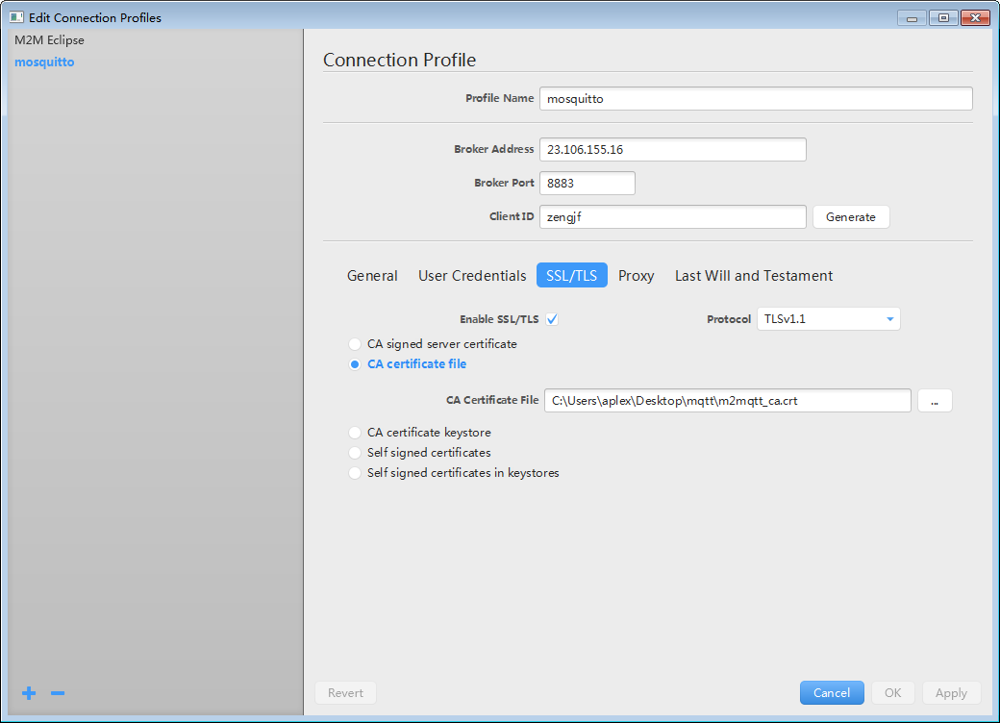
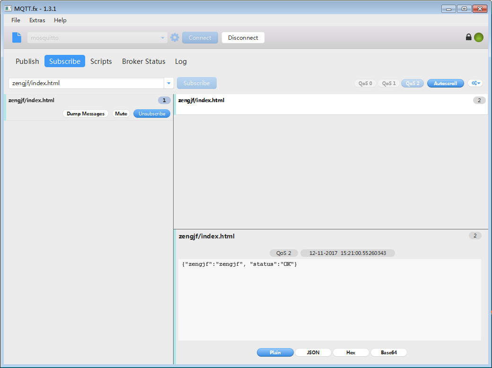
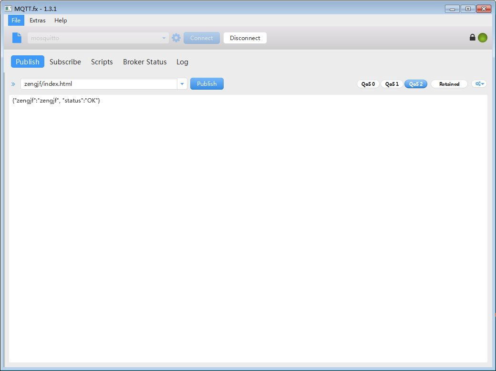

# mosquitto SSL single CA

## 参考文档

* [单向和双向 SSL 认证](https://www.ibm.com/support/knowledgecenter/zh/SSRMWJ_7.0.1/com.ibm.isim.doc/securing/cpt/cpt_ic_security_ssl_scenario.htm)
* [Wrapping MQTT data in SSL certificate while sending it to MQTT broker](https://stackoverflow.com/questions/24637763/wrapping-mqtt-data-in-ssl-certificate-while-sending-it-to-mqtt-broker)
* [那些证书相关的玩意儿(SSL，X.509，PEM，DER，CRT，CER，KEY，CSR，P12等)](http://www.cnblogs.com/guogangj/p/4118605.html)
* [Mosquito使用SSL/TLS进行安全通信时的使用方法](http://blog.csdn.net/houjixin/article/details/24305613)
* [[12]MQTT mosquitto 单向SSL认证的配置方式](http://blog.csdn.net/chancein007/article/details/46293031)
* [MQTT安全篇](http://dataguild.org/?p=6866)
* [mosquitto-tls-7](https://mosquitto.org/man/mosquitto-tls-7.html)

## SSL/TLS

SSL - Secure Sockets Layer，现在应该叫"TLS"，但由于习惯问题，我们还是叫"SSL"比较多。

OpenSSL是SSL的一个实现，SSL只是一种规范。OpenSSL提供了一大堆强大的工具软件，强大到90%我们都用不到。

## 证书标准

X.509 - 这是一种证书标准，主要定义了证书中应该包含哪些内容.其详情可以参考RFC5280，SSL使用的就是这种证书标准.

## 编码格式

同样的X.509证书，可能有不同的编码格式，目前有以下两种编码格式.

* PEM - Privacy Enhanced Mail，打开看文本格式，以"-----BEGIN..."开头， "-----END..."结尾，内容是BASE64编码.
  * 查看PEM格式证书的信息:openssl x509 -in certificate.pem -text -noout
  * Apache和*NIX服务器偏向于使用这种编码格式.
* DER - Distinguished Encoding Rules，打开看是二进制格式，不可读。
  * 查看DER格式证书的信息:openssl x509 -in certificate.der -inform der -text -noout
  * Java和Windows服务器偏向于使用这种编码格式。

## 相关的文件扩展名

这是比较误导人的地方，虽然我们已经知道有PEM和DER这两种编码格式，但文件扩展名并不一定就叫"PEM"或者"DER"，常见的扩展名除了PEM和DER还有以下这些，它们除了编码格式可能不同之外，内容也有差别，但大多数都能相互转换编码格式。

* CRT - CRT应该是certificate的三个字母，其实还是证书的意思，常见于*NIX系统，有可能是PEM编码，也有可能是DER编码，大多数应该是PEM编码，相信你已经知道怎么辨别。
* CER - 还是certificate，还是证书，常见于Windows系统，同样的，可能是PEM编码，也可能是DER编码，大多数应该是DER编码。
* KEY - 通常用来存放一个公钥或者私钥，并非X.509证书，编码同样的，可能是PEM，也可能是DER。
* CSR - Certificate Signing Request，即证书签名请求，这个并不是证书，而是向权威证书颁发机构获得签名证书的申请，其核心内容是一个公钥(当然还附带了一些别的信息)，在生成这个申请的时候，同时也会生成一个私钥，私钥要自己保管好。

## 证书编码的转换

* PEM转为DER openssl x509 -in cert.crt -outform der -out cert.der
* DER转为PEM openssl x509 -in cert.crt -inform der -outform pem -out cert.pem

## 获得证书

SSL在身份认证过程中需要有一个双方都信任的CA签发的证书，CA签发证书是需要收费的，但是在测试过程中，可以自己产生一个CA，然后用自己产生的CA签发证书。

### 向权威证书颁发机构申请证书

`openssl req -newkey rsa:2048 -new -nodes -keyout my.key -out my.csr`

把csr交给权威证书颁发机构，权威证书颁发机构对此进行签名，完成。保留好csr，当权威证书颁发机构颁发的证书过期的时候，你还可以用同样的csr来申请新的证书，key保持不变。

### 生成自签名的证书

`openssl req -newkey rsa:2048 -new -nodes -x509 -days 3650 -keyout key.pem -out cert.pem`

在生成证书的过程中会要你填一堆的东西，其实真正要填的只有Common Name，通常填写你服务器的域名，如"yourcompany.com"，或者你服务器的IP地址，其它都可以留空的。

生产环境中还是不要使用自签的证书，否则浏览器会不认，或者如果你是企业应用的话能够强制让用户的浏览器接受你的自签证书也行.向权威机构要证书通常是要钱的，但现在也有免费的，仅仅需要一个简单的域名验证即可。有兴趣的话查查"沃通数字证书"。

## 命令解析

* openssl req -new -x509 -days 36500 -extensions v3_ca -keyout ca.key -out ca.crt
  * 产生CA认证的key和证书文件；
  * 产生一个名字为"ca.key"的key文件和一个名字为"ca.crt"的证书文件，这个crt就是CA认证自己给自己签名的证书文件；
  * 命令中选项“-x509”表示该条命令将产生自签名的证书，一般都是测试的时候采用。
* openssl genrsa -out server.key 2048
  * 产生一个不加密的RSA私钥，其中参数"2048"表示私钥的长度，这里产生的私钥文件"server.key"将在下一步使用，同时在mosquitto程序的配置文件中也需要使用。
* openssl req -out server.csr -key server.key -new
  * 使用上一步产生的"server.key"文件为server产生一个签发证书所需要的请求文件：server.csr，使用该文件向CA发送请求才会得到CA签发的证书。
* openssl x509 -req -in server.csr -CA ca.crt -CAkey ca.key -CAcreateserial -out server.crt -days 36500
  * 使用CA的密钥文件ca.key，CA的证书文件ca.crt和上一步为mosquitto server产生证书请求文件server.csr文件这三个文件向CA请求产生一个证书文件，证书文件的名字为：server.crt。该命令中的36500可以修改为自己定义的时间值。
* openssl genrsa -out client.key 2048
  * 为mosquitto的客户端程序产生私钥文件"client.key"和证书文件"client.crt"
* openssl req -out client.csr -key client.key -new
  * 为mosquitto客户端产生一个签发证书的请求文件"client.csr"；
  * 产生证书请求文件时需要第一步产生的私钥文件client.key作为输入。
* openssl x509 -req -in client.csr -CA ca.crt -CAkey ca.key -CAcreateserial -out client.crt -days 36500
  * CA为mosquitto客户端产生一个证书文件"client.crt"

**注意事项**

* 制作签发证书的请求文件时，需要输入Common Name参数，此参数一定为当前主机的IP地址；
* 如果不想SSL在身份认证的时候检查主机名（也即上面不检查第1条中Common Name参数），则需要在启动订阅端的时候，加上“--insecure”参数；
* 自测过程中，server端与所有客户端所使用的证书必须由一个CA签发，否则，将会提示CA不识别的问题。

## 用户名、密码

* `sudo mosquitto_passwd -c /etc/mosquitto/passwd zengjf`
* `sudo nano /etc/mosquitto/conf.d/default.conf`
  ```
  allow_anonymous false
  password_file /etc/mosquitto/passwd  
  ```
* `sudo systemctl restart mosquitto`
* `mosquitto_sub -h localhost -t test -u "zengjf" -P "password"`
* `mosquitto_pub -h localhost -t "test" -m "hello world" -u "zengjf" -P "password"`

## 测试方法

* 参考[《Enable Secure Communication with TLS and the Mosquitto Broker》](https://mcuoneclipse.com/2017/04/14/enable-secure-communication-with-tls-and-the-mosquitto-broker/)中的方法进行测试；
* 测试工具下载：[MQTT.fx](http://mqttfx.jensd.de/index.php/download)；
* MQTT.fx连接配置如下：
  
* Subscribe：
  
* Publish：
  
* mosquitto Server Message：
  ```
  root@localhost:/etc/mosquitto/tls# /usr/sbin/mosquitto -c /etc/mosquitto/mosquitto.conf -v
  1510471514: mosquitto version 1.4.8 (build date Mon, 26 Jun 2017 09:31:02 +0100) starting
  1510471514: Config loaded from /etc/mosquitto/mosquitto.conf.
  1510471514: Opening ipv4 listen socket on port 8883.
  1510471514: Opening ipv6 listen socket on port 8883.
  1510471521: New connection from 219.133.225.171 on port 8883.
  1510471522: New client connected from 219.133.225.171 as zengjf (c1, k60, u'zengjf').
  1510471522: Sending CONNACK to zengjf (0, 0)
  1510471526: Received SUBSCRIBE from zengjf
  1510471526:     zengjf/index.html (QoS 2)
  1510471526: zengjf 2 zengjf/index.html
  1510471526: Sending SUBACK to zengjf
  1510471533: Received PUBLISH from zengjf (d0, q2, r0, m2, 'zengjf/index.html', ... (34 bytes))
  1510471533: Sending PUBREC to zengjf (Mid: 2)
  1510471533: Received PUBREL from zengjf (Mid: 2)
  1510471533: Sending PUBCOMP to zengjf (Mid: 2)
  1510471533: Sending PUBLISH to zengjf (d0, q2, r0, m1, 'zengjf/index.html', ... (34 bytes))
  1510471534: Received PUBREC from zengjf (Mid: 1)
  1510471534: Sending PUBREL to zengjf (Mid: 1)
  1510471534: Received PUBCOMP from zengjf (Mid: 1)
  ```
* Server上测试：[../code/py3/server_tls_srv.py](../code/py3/server_tls_srv.py)
* i.MX6上测试：[../code/py3/server_tls_ca.py](../code/py3/server_tls_ca.py)

**注意事项**

不知道为什么，我用同样的方式，直接在VPS服务器上进行相关测试，总是说证书不对，用server的crt就是能够正常连接。

不过根据当前的测试情况来看，如果想要看SSL配置是否成功了，可以直接将上面的ca.crt证书换成server的.crt证书。
