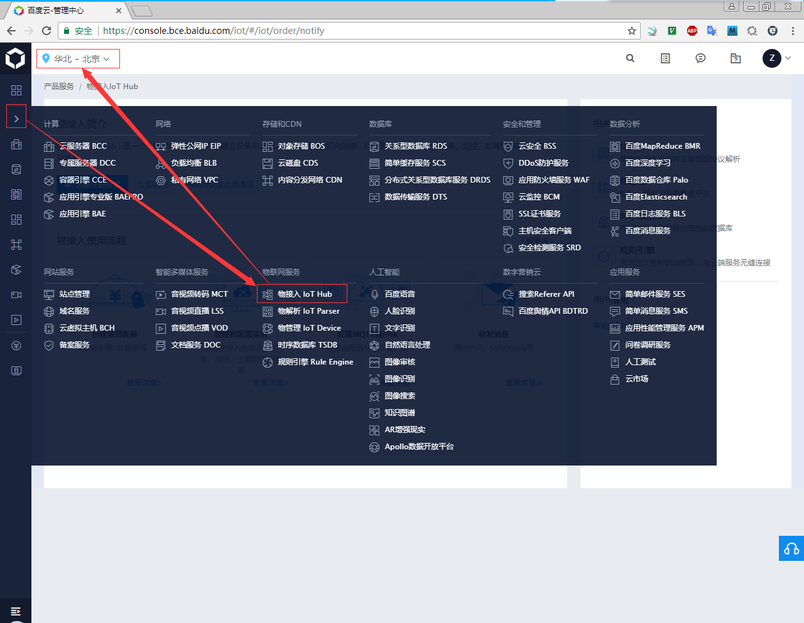
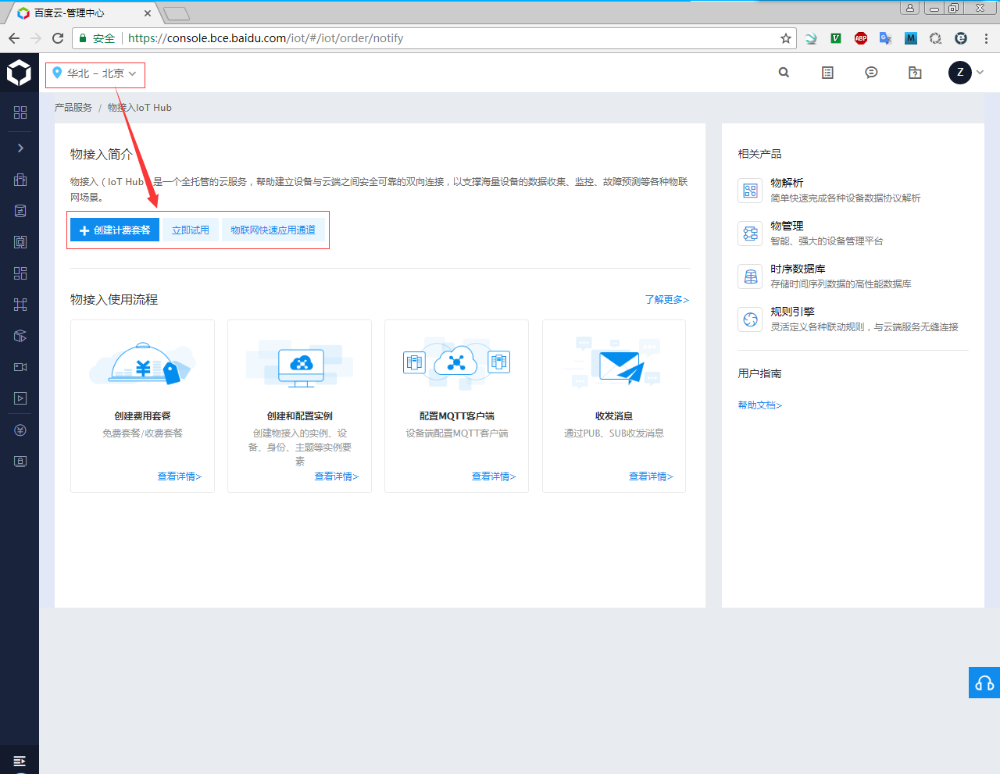
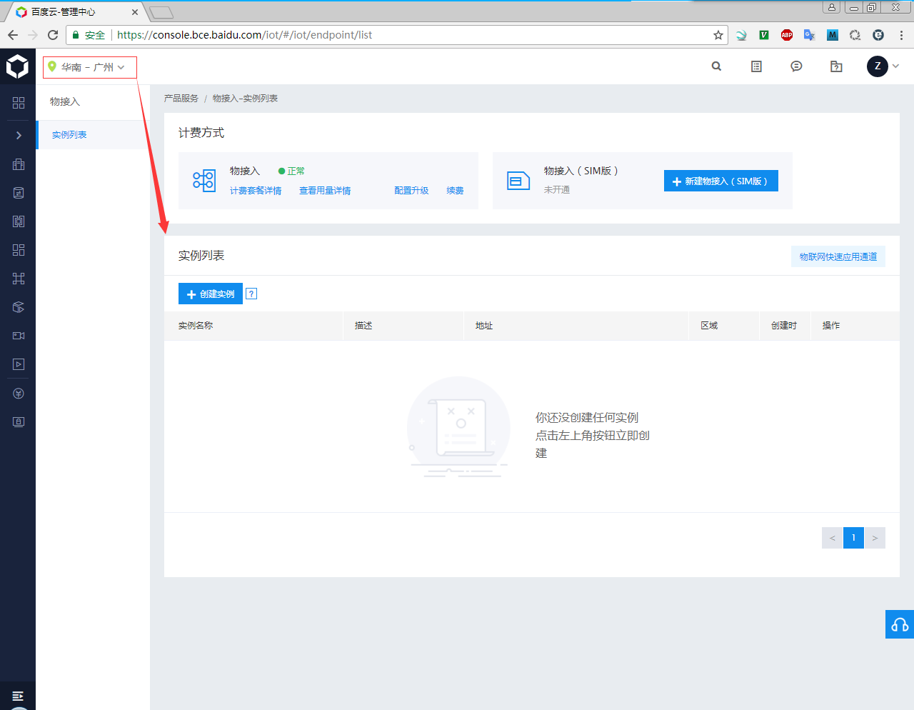
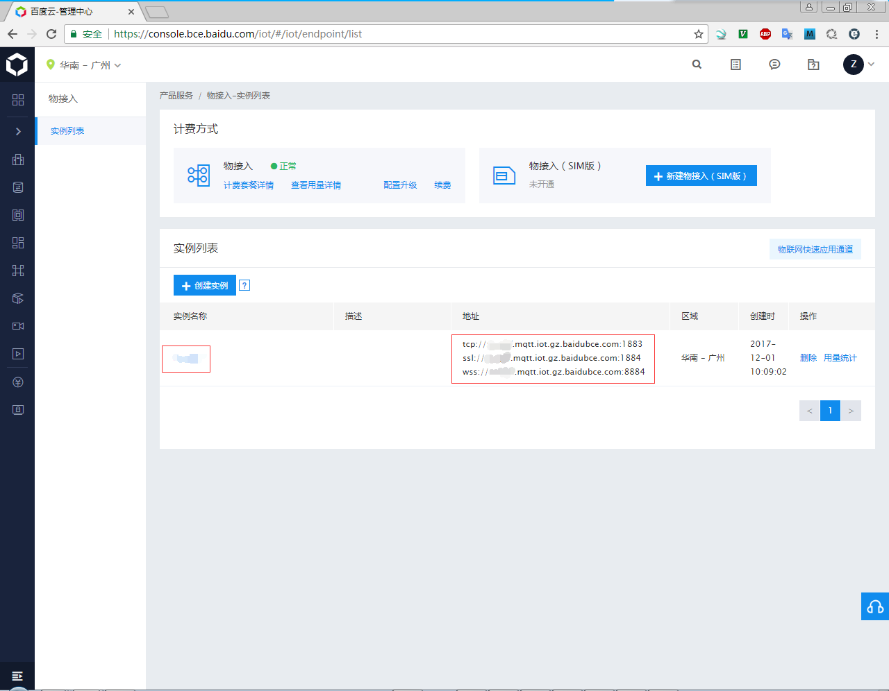
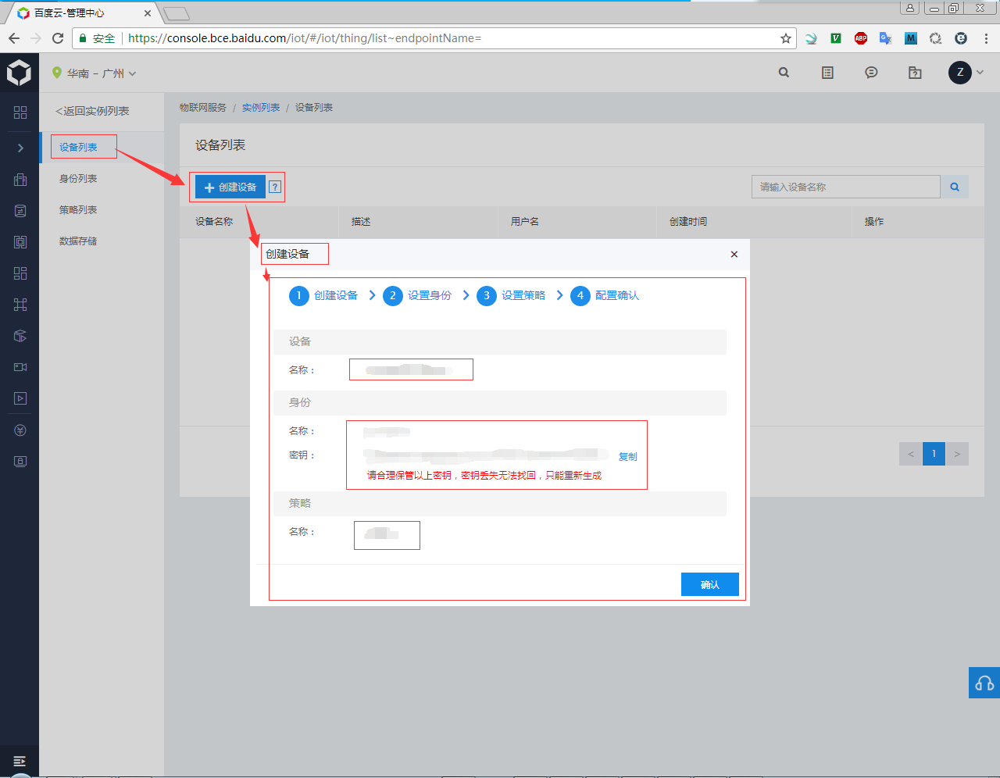
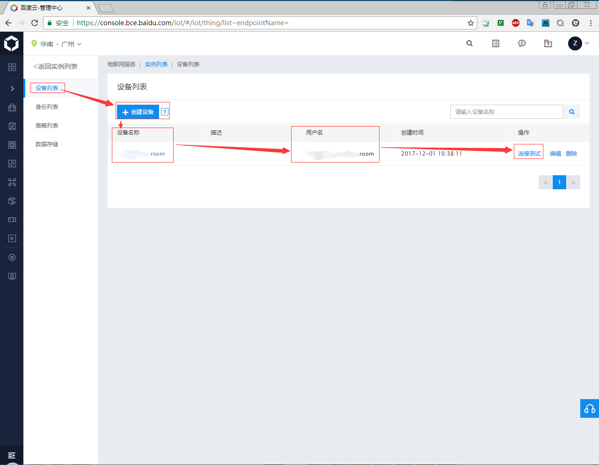
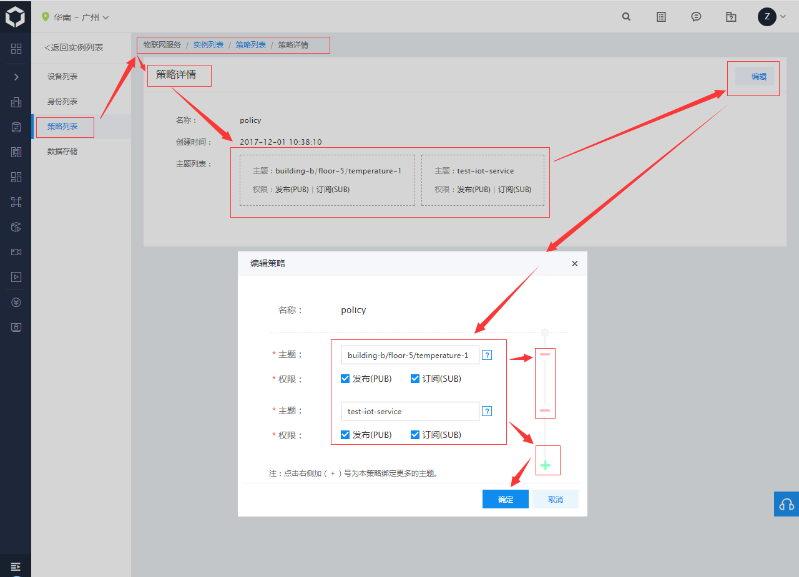
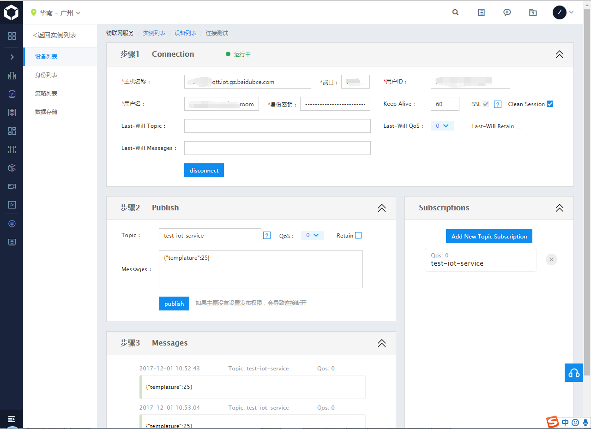
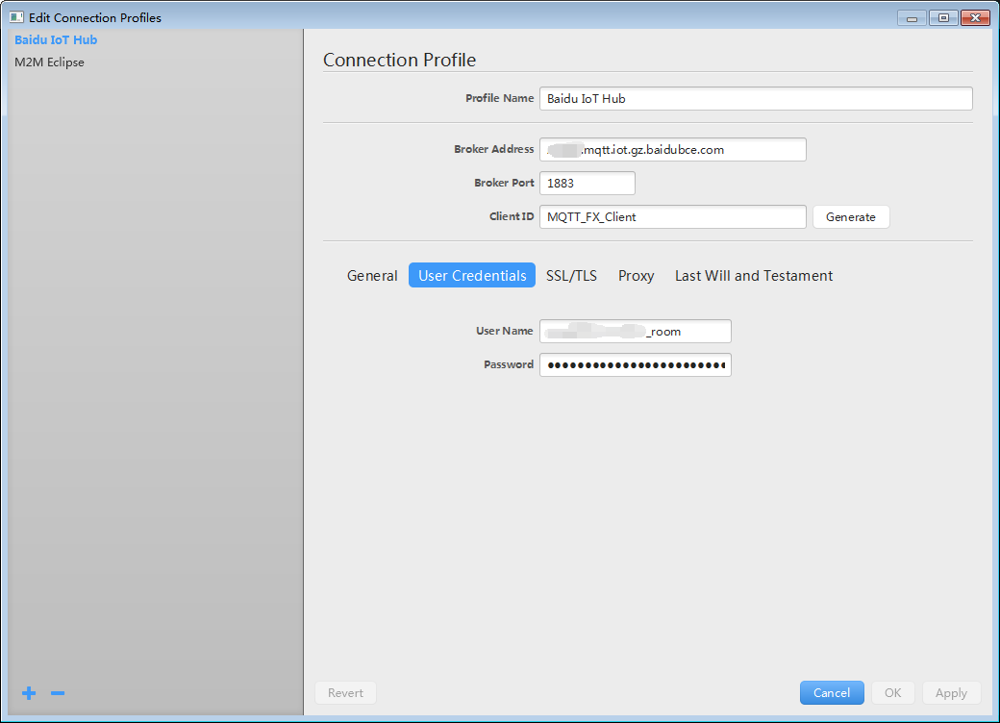
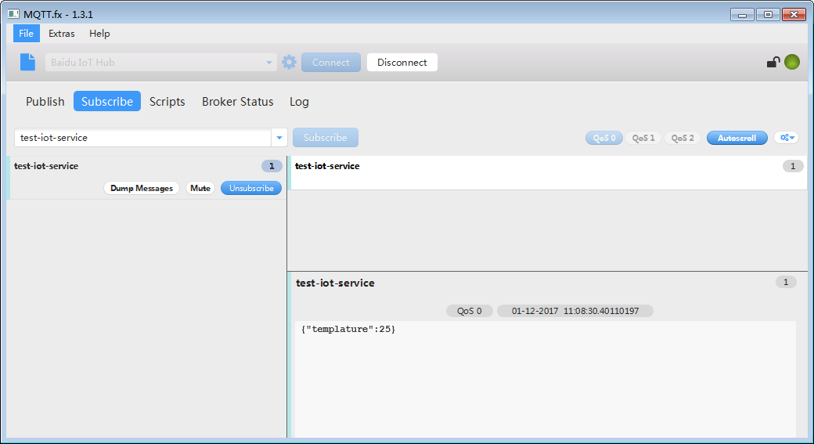

# Baidu IoT Hub

由于需要将设备获取的信息通过MQTT协议发送的服务器，看一下百度天工的工作方式。

## IoT Hub配置

* 注册账号、认证账号，选择区域，这里显示的北京：
  
* 选择创建的IoT Hub的模式，这里1百万条是免费的：
  
* 创建IoT Hub之后的主界面，由于本人是在深圳，所以选择了广州的服务器：
  
* 创建IoT实例，点击前面的实例名称可以进入配置实例：
  
* [配置实例](https://cloud.baidu.com/doc/IOT/Quickstart.html#.E5.88.9B.E5.BB.BA.E5.AE.9E.E4.BE.8B)界面：：
  
* [创建设备](https://cloud.baidu.com/doc/IOT/Quickstart/24.5C.E9.85.8D.E7.BD.AE.E5.AE.9E.E4.BE.8B.html)：：
  
  `QE0BHFvFnIkBRIaJtPYzo3m/63Esv5fzzMr9tYVOsHo=`
* 设备用户名：
  
* 添加Topic
  
* 设备测试：
  

## MQTT.fx测试

* [配置MQTT客户端](https://cloud.baidu.com/doc/IOT/Quickstart.html#.E9.85.8D.E7.BD.AEMQTT.E5.AE.A2.E6.88.B7.E7.AB.AF)：
  
* MQTT客户端Subscribe：
  
  
## VPS测试

* [../code/IoT_Hub/publish.py](../code/IoT_Hub/publish.py)
* [../code/IoT_Hub/subscribe.py](../code/IoT_Hub/subscribe.py)
