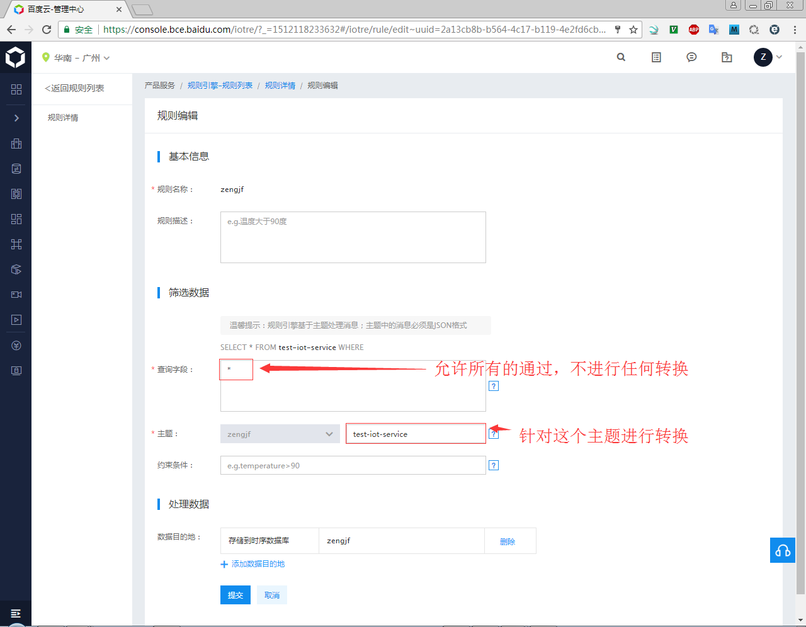
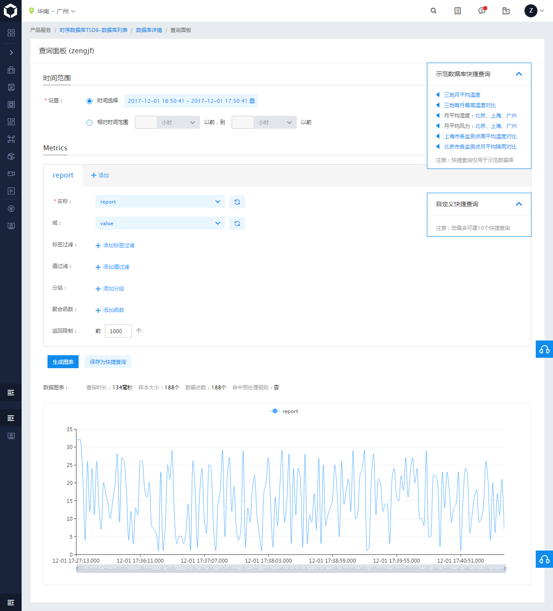
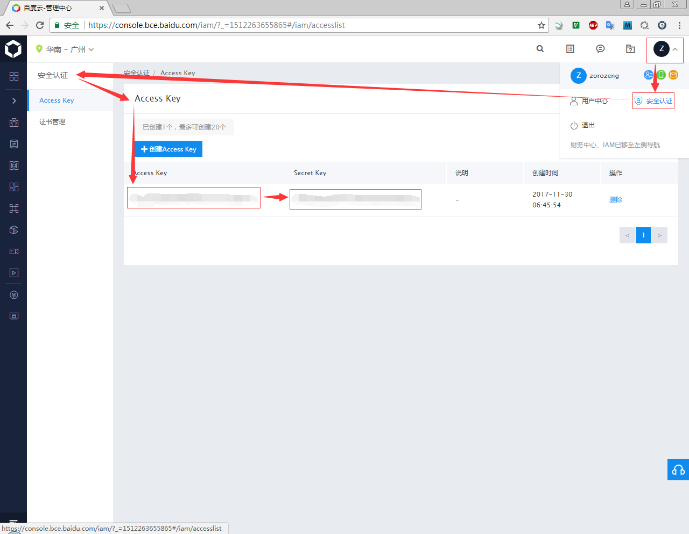

# Baidu IoT Hub

* [产品配置操作问题](https://cloud.baidu.com/doc/IOT/FAQ.html#.99.E9.29.DF.F5.F8.42.48.E8.BE.23.DC.DA.AA.77.74)
* [时序数据库](https://cloud.baidu.com/product/tsdb.html)
* [规则引擎](https://cloud.baidu.com/product/re.html)
* [创建规则](https://cloud.baidu.com/doc/RE/GUIGettingStarted.html#.E5.88.9B.E5.BB.BA.E8.A7.84.E5.88.99)
* [将消息转发至TSDB](https://cloud.baidu.com/doc/RE/GUIGettingStarted.html#.E5.B0.86.E6.B6.88.E6.81.AF.E8.BD.AC.E5.8F.91.E8.87.B3TSDB)
* [数据点查询](https://cloud.baidu.com/doc/TSDB/FAQ.html#.8D.F6.6D.4C.08.1F.0B.71.C4.09.87.F7.ED.BA.FD.39)
* [如何获取AK / SK](https://cloud.baidu.com/doc/Reference/GetAKSK.html#.E5.A6.82.E4.BD.95.E8.8E.B7.E5.8F.96AK.20.2F.20SK)
* [How do I manually fire HTTP POST requests with Firefox or Chrome? [closed]](https://stackoverflow.com/questions/4797534/how-do-i-manually-fire-http-post-requests-with-firefox-or-chrome)


## 将消息转发至TSDB

TSDB数据库要求数据必须包含**metric**、**value**和**timestamp**三个字段，以及额外一个或多个数据作为tag。如果原始消息中不包含这些字段，在将数据转发至TSDB前，需要对数据格式进行调整，如下所示：

## Rule Engine

设置Rule Engine，将IoT Hub中传输的数据转发存储到TSDB中。



## TSDB查询数据



## Publish Code

[../code/TSDB/publish.py](../code/TSDB/publish.py)

**数据格式**

```
{
    "metric":"report",
    "_timestamp": 175898797,
    "_value": 32,
    "id": "70:00:83:24:38:85", 
    "machine": "arm",
    "os": "linux",
    "categories": "data", 
    "type": "temperature"
}
```

## 签名生成算法

* [如何获取AK / SK](https://cloud.baidu.com/doc/Reference/GetAKSK.html#.E5.A6.82.E4.BD.95.E8.8E.B7.E5.8F.96AK.20.2F.20SK)
* [在Header中包含认证字符串](https://cloud.baidu.com/doc/Reference/AuthenticationMechanism.html#.4C.F8.3B.FE.F1.51.77.57.26.5B.61.A8.F5.39.C2.B1)
* [生成认证字符串](https://cloud.baidu.com/doc/Reference/AuthenticationMechanism.html#1.1.20.E6.A6.82.E8.BF.B0)
* [UNIX时间戳转换、UNIX时间戳普通时间相互转换、unix timestamp转换](https://1024tools.com/timestamp)
* [百度物联网视频教程系列](https://cloud.baidu.com/forum/topic/show?topicId=36509)



* Access Key: 5c5b5ea289ed4c6db75c131e7eaf5715
* Secret Key: ca49ed4d426541e79f7da83fde4b9e28
* [data string](https://1024tools.com/timestamp): 
  * data(T08——东八区): 2017-11-30 06:45:54
  * timestamp: 1511995554
  * data(T00——世界时间): 2017-11-29 22:45:54
  * data string: 2017-11-29T22:45:54Z
* authStringPrefix: bce-auth-v1/5c5b5ea289ed4c6db75c131e7eaf5715/1511995554/1800
* [Computed HMAC](https://www.freeformatter.com/hmac-generator.html#ad-output) SHA256: e2b3541551022677181eb4bacdfd1ea580cd26004adaffe2a1b5f1c8d9a11f7e
* uri: /v1/metric
* CanonicalRequest:
  * sting
    ```
    HTTP POST 
    /v1/metric
    content-type: application%2Fjson; charset=utf-8
    host: zengjf.tsdb.iot.gz.baidubce.com
    ```
  * a202f5b42ada8fbaab658507c17a294c18512d922e5172c0ea500124fbfdef87
    
bce-auth-v1/5c5b5ea289ed4c6db75c131e7eaf5715/1511995554/1800//a202f5b42ada8fbaab658507c17a294c18512d922e5172c0ea500124fbfdef87
bce-auth-v1/5c5b5ea289ed4c6db75c131e7eaf5715/2017-11-29T22:45:54Z/1800//caca4da0578fb73654b764cf40dbd125a2a0f973abe62a76a3e814e29bdac903


GET /v1/metric HTTP/1.1
Host: zengjf.tsdb.iot.gz.baidubce.com
Authorization: bce-auth-v1/5c5b5ea289ed4c6db75c131e7eaf5715/2017-11-29T22:45:54Z/1800//caca4da0578fb73654b764cf40dbd125a2a0f973abe62a76a3e814e29bdac903
Content-Type: application/json; charset=utf-8
x-bce-date: 2017-11-29T22:45:54Z
Cache-Control: no-cache
Postman-Token: e99cf04d-1bd2-e839-be7c-e43bde986288

'%sT%sZ' % (datetime.utcnow().strftime("%Y%m%d"), datetime.utcnow().strftime("%h%M%S"))
'%sT%sZ' % (datetime.utcnow().strftime("%Y%m%d"), datetime.utcnow().strftime("%Y%m%d"))
'%sT%sZ' % (datetime.utcnow().strftime("%Y%m%d"), datetime.utcnow().strftime("%H%M%S"))
