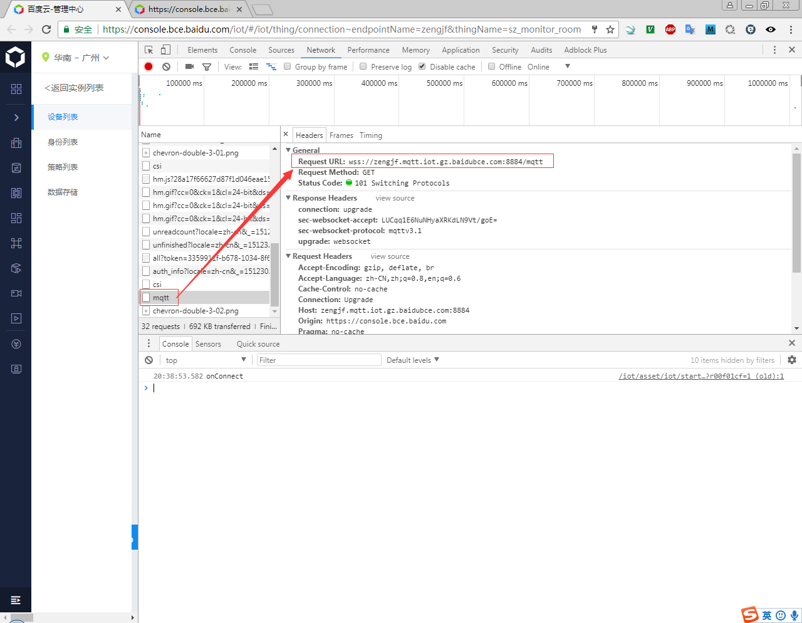
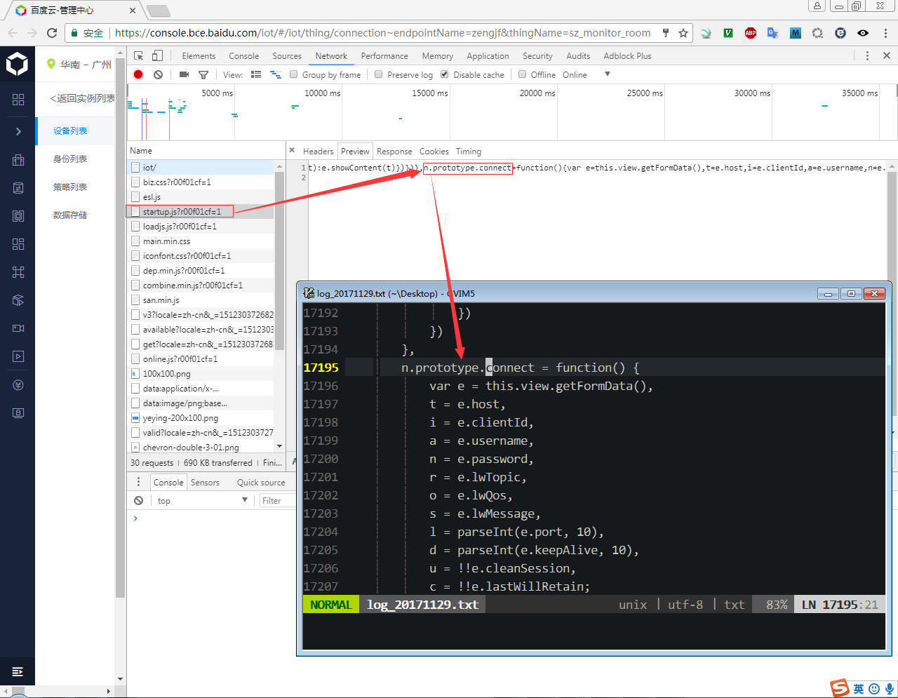
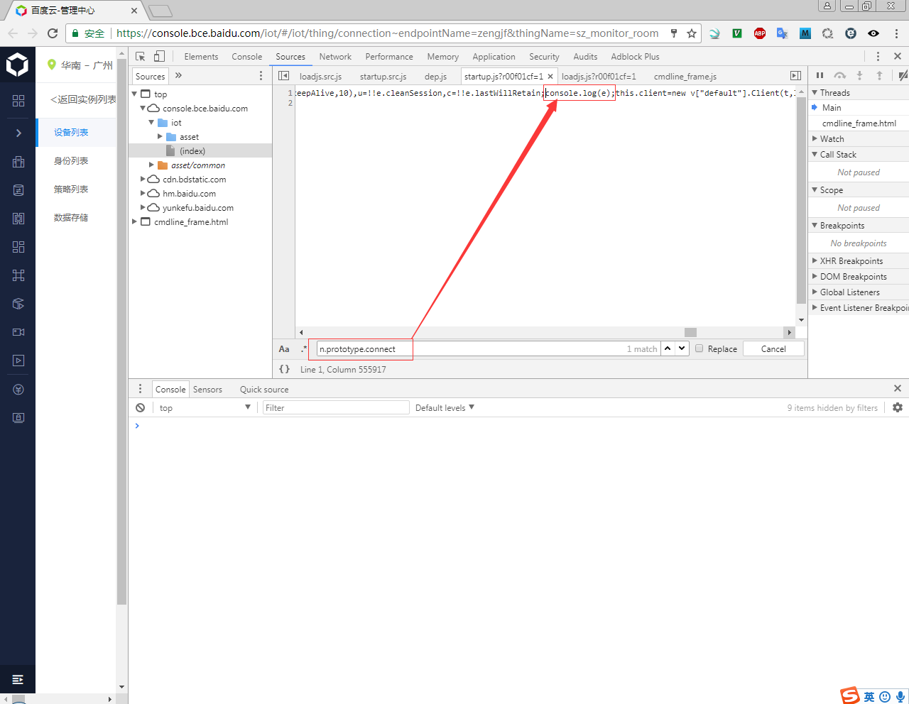

# Baidu IoT Hub MTML5 MQTT

## Baidu IoT Hub在线测试Connect分析

* 查看请求地址：
  
* 查看链接数据：
  
* 加入调试信息：

* Connect代码：
  ```
  n.prototype.connect = function() {
      var e = this.view.getFormData(),
      t = e.host,
      i = e.clientId,
      a = e.username,
      n = e.password,
      r = e.lwTopic,
      o = e.lwQos,
      s = e.lwMessage,
      l = parseInt(e.port, 10),
      d = parseInt(e.keepAlive, 10),
      u = !!e.cleanSession,
      c = !!e.lastWillRetain;
      this.client = new v["default"].Client(t, l, i),
      this.client.onConnectionLost = f["default"].bind(this.onConnectionLost, this),
      this.client.onMessageArrived = f["default"].bind(this.onMessageArrived, this);
      console.log(e);
      var p = {
          timeout: 3,
          keepAliveInterval: d,
          cleanSession: u,
          useSSL: !0,
          onSuccess: f["default"].bind(this.onConnect, this),
          onFailure: f["default"].bind(this.onFail, this)
      };
      if (a.length > 0 && (p.userName = a), n.length > 0 && (p.password = n), r.length > 0) {
          var m = new v["default"].Message(s);
          m.qos = o,
          m.destinationName = r,
          m.retained = c,
          p.willMessage = m
      }
      try {
          this.client.connect(p)
      } catch(h) {
          this.view.showToast("连接失败", {
              messageType: "error"
          })
      }
  },
  ```
* [../code/IoT_Hub/startup.js](../code/IoT_Hub/startup.js)

## 个人测试用例代码：

[../code/html/index_iot_hub.html](../code/html/index_iot_hub.html)

```html
<!DOCTYPE html>
<html>
  <head>
    <title>Start Page</title>
    <meta http-equiv="Content-Type" content="text/html; charset=UTF-8">
    <script src="https://cdnjs.cloudflare.com/ajax/libs/paho-mqtt/1.0.1/mqttws31.min.js" type="text/javascript"></script>
  </head>
  <body>

    <!-- 
        Eclipse Paho JavaScript Client 
            https://www.eclipse.org/paho/clients/js/
    -->
 
    <script>
        // Create a client instance
        var client = new Paho.MQTT.Client("zengjf.mqtt.iot.gz.baidubce.com", 8884, "DeviceId-egkn9o");
        
        // set callback handlers
        client.onConnectionLost = onConnectionLost;
        client.onMessageArrived = onMessageArrived;
        
        // connect the client
        client.connect({onSuccess:onConnect, onFailure:onConnectError, userName:"zengjf/sz_monitor_room", password:"QE0BHFvFnIkBRIaJtPYzo3m/63Esv5fzzMr9tYVOsHo=", useSSL:true});
        
        
        // called when the client connects
        function onConnect() {
          // Once a connection has been made, make a subscription and send a message.
          console.log("onConnect");
          client.subscribe("test-iot-service");

          topicMessage = new Paho.MQTT.Message("{message:This is a message where the topic is set by setTopic}");
          topicMessage.destinationName = "test-iot-service";    // 这里的topic一定要正确, 否则AMQJS0008I Socket closed error。
          client.send(topicMessage)
        }

        // called when the client connects
        function onConnectError() {
          // Once a connection has been made, make a subscription and send a message.
          console.log("onConnectError");
        }
        
        // called when the client loses its connection
        function onConnectionLost(responseObject) {
          if (responseObject.errorCode !== 0) {
            console.log("onConnectionLost:"+responseObject.errorMessage);
          }
        }
        
        // called when a message arrives
        function onMessageArrived(message) {
          console.log("onMessageArrived:"+message.payloadString);
        }
 
        console.log("MQTT Client Set Over, Wait Data Tranfer.")
    </script>
  </body>
</html>
```
