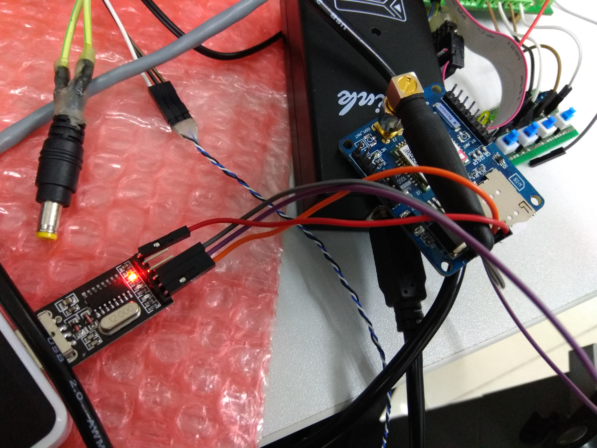
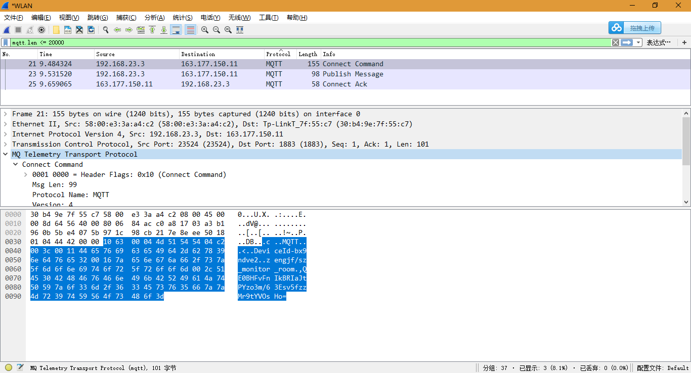
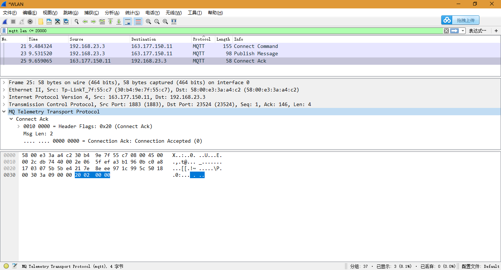
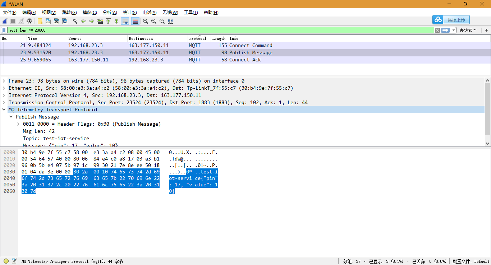
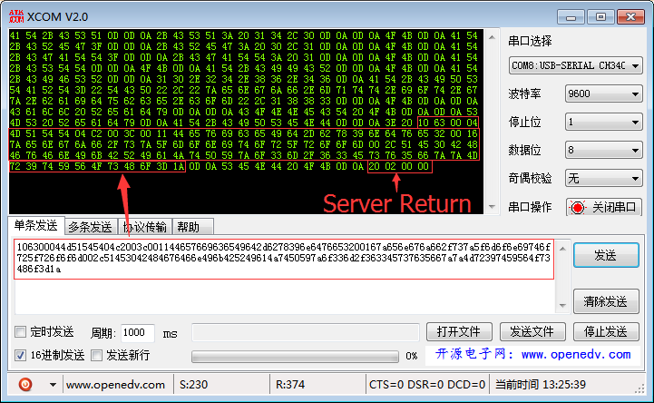
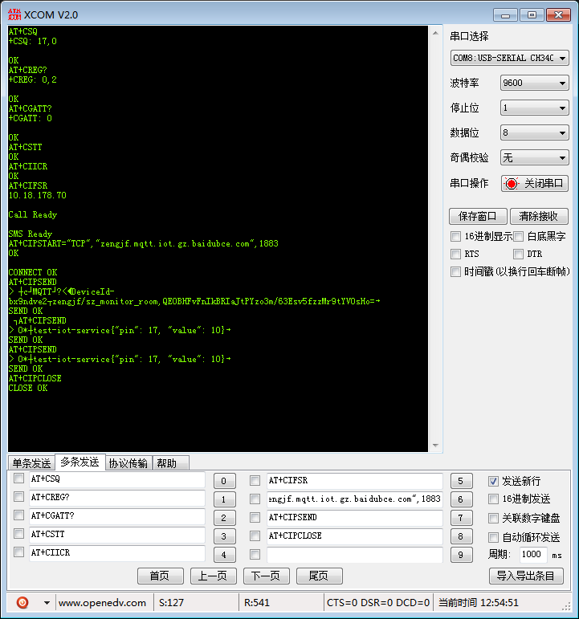
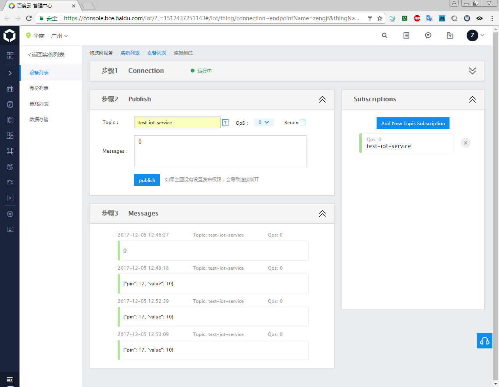

# baidu IoT Hub SIM800C

如下是SIM800C连接串口线连线图：



## WireShark Capture Data

* Excute Python Script: [../code/IoT_Hub/publish.py](../code/IoT_Hub/publish.py)
* Connect Data:
    
  connect data: `106300044d51545404c2003c001144657669636549642d6278396e6476653200167a656e676a662f737a5f6d6f6e69746f725f726f6f6d002c51453042484676466e496b425249614a7450597a6f336d2f363345737635667a7a4d72397459564f73486f3d`
  send data:`106300044d51545404c2003c001144657669636549642d6278396e6476653200167a656e676a662f737a5f6d6f6e69746f725f726f6f6d002c51453042484676466e496b425249614a7450597a6f336d2f363345737635667a7a4d72397459564f73486f3d1a`
* Connect ACK Data:
  
  connect ack data: `20020000`
* Publish Data:
  
  publish data: `302a0010746573742d696f742d736572766963657b2270696e223a2031372c202276616c7565223a2031307d`
  send data: `302a0010746573742d696f742d736572766963657b2270696e223a2031372c202276616c7565223a2031307d1a`

## SIM800C Test

* SIM800C Connect And Connect ACK:
  
* UART Send Data Command:
    
  ```
  AT+CSQ
  +CSQ: 17,0
  
  OK
  AT+CREG?
  +CREG: 0,2
  
  OK
  AT+CGATT?
  +CGATT: 0
  
  OK
  AT+CSTT
  OK
  AT+CIICR
  OK
  AT+CIFSR
  10.18.178.70
  
  Call Ready
  
  SMS Ready
  AT+CIPSTART="TCP","zengjf.mqtt.iot.gz.baidubce.com",1883
  OK
  
  CONNECT OK
  AT+CIPSEND
  > cMQTT?<DeviceId-bx9ndve2zengjf/sz_monitor_room,QE0BHFvFnIkBRIaJtPYzo3m/63Esv5fzzMr9tYVOsHo=
  SEND OK
   AT+CIPSEND
  > 0*test-iot-service{"pin": 17, "value": 10}
  SEND OK
  AT+CIPSEND
  > 0*test-iot-service{"pin": 17, "value": 10}
  SEND OK
  AT+CIPCLOSE
  CLOSE OK
  ```
* IoT Hub Receive Data Panel:
  
* 至于里面的命令，可以参考：
  ```
  AT+CSQ    //查询网络信号质量
  AT+CREG?  //查询网络注册情况 其中第二个参数为1或5则说明已经注册成功
  AT+CGATT? //查询模块是否附着 GPRS 网络
  AT+CSTT   //设置APN
  AT+CIICR  //激活移动场景
  AT+CIFSR  //获得本地IP地址
  # AT+CIPSTART="TCP","tcp.tlink.io",8647  //建立TCP/IP连接
  AT+CIPSTART="TCP","zengjf.mqtt.iot.gz.baidubce.com",1883
  AT+CIPSEND    //模块向服务器发送数据
  CM1Y7DU46G2I8919  //不发送新行
  AT+CIPSEND
  @,34#             //不发送新行 
  
  AT+CIPGSMLOC=1,1  //获取定位信息   
  
  SIM800 系列 LBS（基站定位）使用
  AT+SAPBR=3,1,"Contype","GPRS"
  // 设置选择 GPRS 服务模式
  OK
  AT+SAPBR=3,1,"APN","CMNET"
  // 设置 APN
  OK
  AT+SAPBR=1,1
  // PDP 激活,这个和 TCP/IP 同时使用不冲突
  OK
  AT+SAPBR=2,1
  // 获取 IP 地址
  +SAPBR: 1,1,"10.144.156.178"
  OK
  AT+CLBSCFG=0,3
  // 查询目前使用 LBS 功能默认选择的地址信息
  +CLBSCFG: 0,3,"www.c4a.com.cn:3002"
  // 这个地址是完全免费的
  OK
  AT+CLBS=1,1
  +CLBS: 0,121.358585,31.219023,550
  // 获取经纬度
  OK
  AT+CLBS=4,1
  +CLBS: 0,121.358599,31.219034,550,17/02/25,09:33:01 // 获取信
  息详细些,包括时间信息,需要+8
  OK
  AT+SAPBR=0,1
  OK      
  
  UDP:
  AT+CGATT?
  AT+CSTT="CMNET"
  AT+CIICR
  AT+CIFSR
  AT+CIPSTART="UDP","23.106.155.16","9098"
  
  AT+CIPSEND    //发送数据
  
  AT+CIPCLOSE或AT+CIPSHUT 关闭TCP连接
  ```
