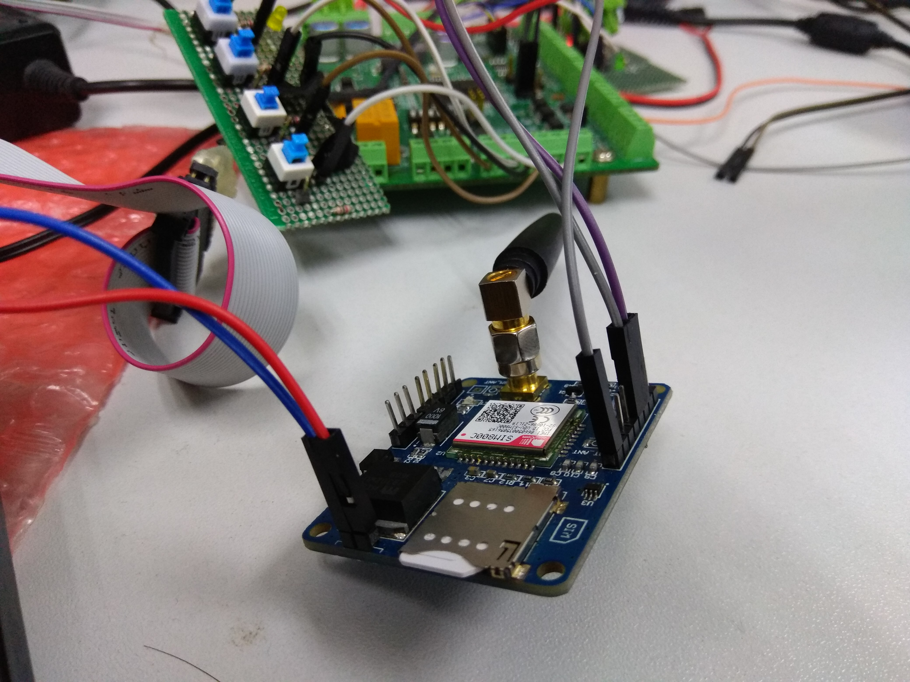
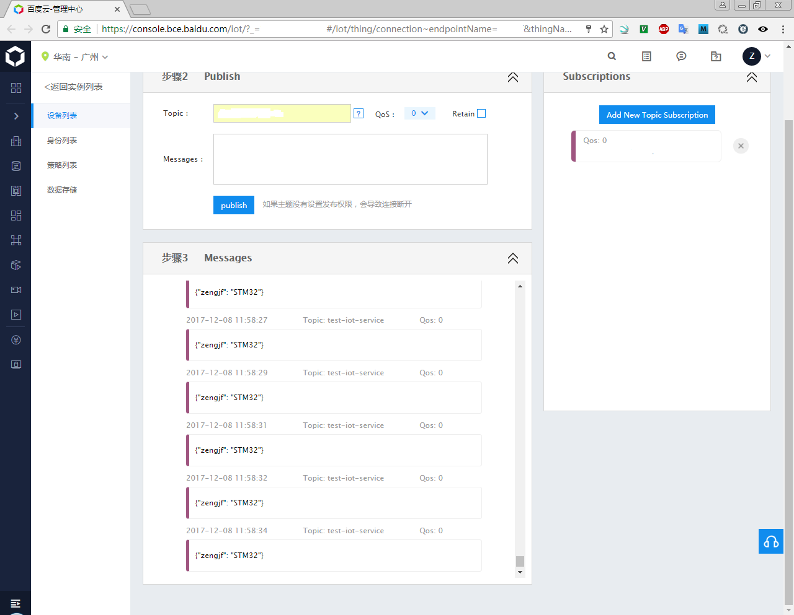
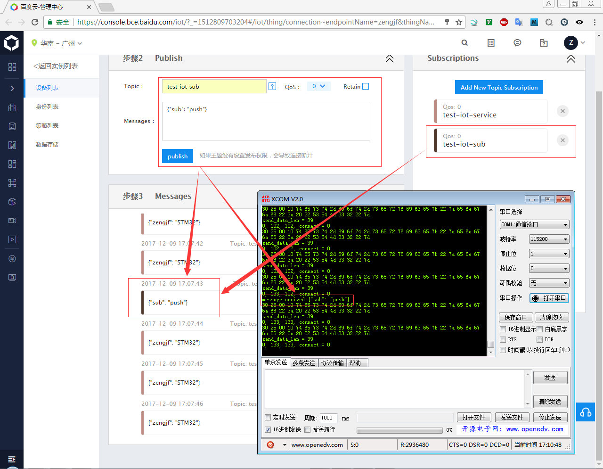

# baidu IoT Hub paho.mqtt.embedded-c STM32

## 参考文档

* [../refers/sim800_series_tcpip_application_note_v1.00.pdf](../refers/sim800_series_tcpip_application_note_v1.00.pdf)
* [../refers/SIM800系列_TCPIP_应用文档_V1.02.pdf](../refers/SIM800系列_TCPIP_应用文档_V1.02.pdf)
* [../refers/SIM800_Series_AT_Command_Manual_V1.09.pdf](../refers/SIM800_Series_AT_Command_Manual_V1.09.pdf)
* [SIM800C 透传模式](http://www.cnblogs.com/zengjfgit/p/8000945.html)

## Serial Tool

* [../refers/XCOM_V2.0.exe](../refers/XCOM_V2.0.exe)

## Hardware Connect

## STM32 Console

## STM32 Publish

## 长时间发送CLOSE

## 拔出卡之后再插入SIM卡，测试断线

## Publish & Subscription

