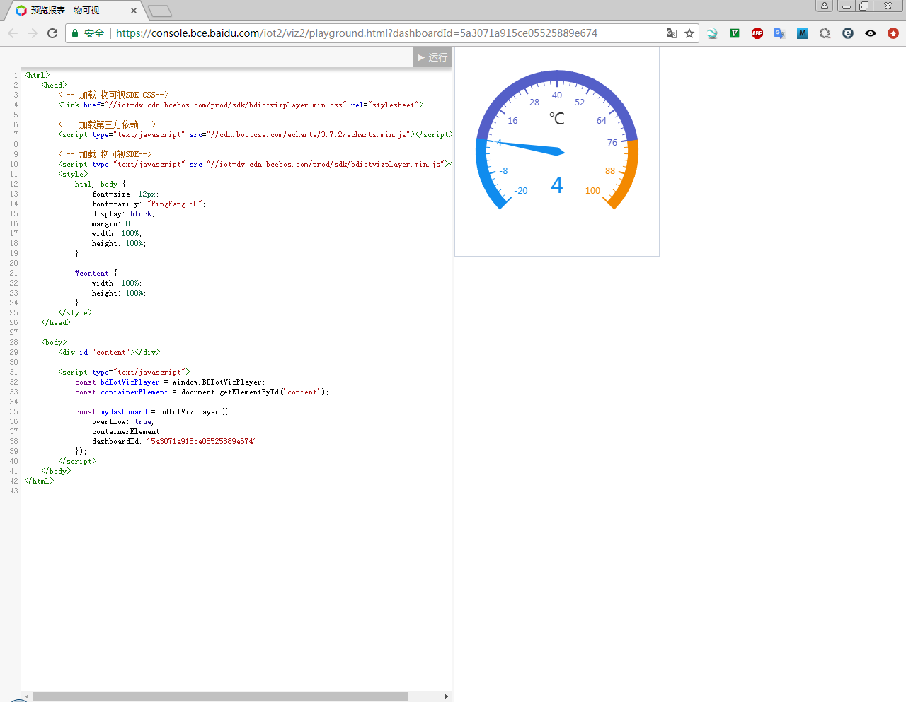
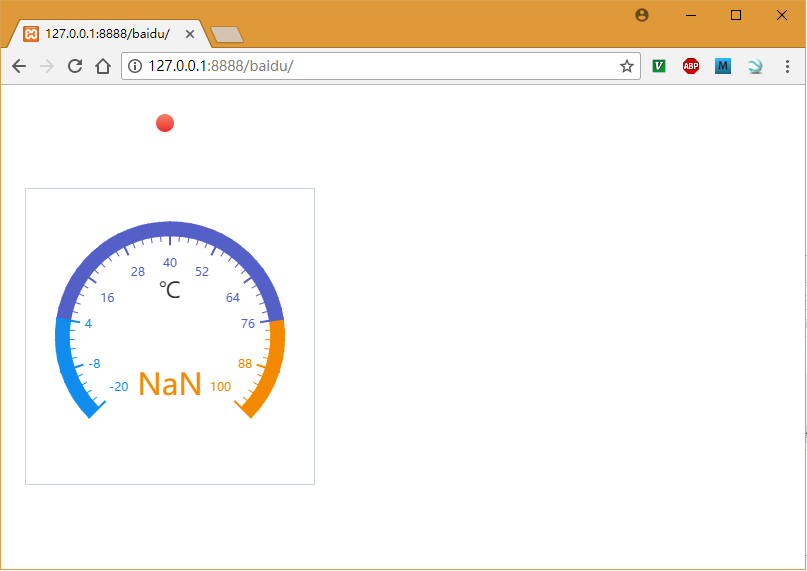

# baidu IoT Hub IoT Visualization sign-aas

## 参考文档

* [部署](https://cloud.baidu.com/doc/IOTVIZ/GettingStarted.html#.E5.90.8E.E7.AB.AF.E9.9B.86.E6.88.90)
* [集成到 React 应用中](https://cloud.baidu.com/doc/IOTVIZ/BestPractise.html#.E4.BF.AE.E6.94.B9.E4.BB.A3.E7.A0.81)
  * 这里一定要理解文中的**将Token写入Cookie**这部分；

## Token Tool Download

* [sign-aas Python3版本](http://iot-dv.cdn.bcebos.com/v2/sdk/sign-aas.jar)

## sign-aas help

```
C:\Users\aplex\Desktop\mqtt\docs\refers>java -jar sign-aas.jar
2017-12-13 09:16:46.781:INFO::main: Logging initialized @7282ms
使用方法：java -jar 文件名.jar [options] [配置文件.json]

options 选项列表：
      --ak AccessKey        指定AccessKey，结合默认配置使用
      --sk SecretAccessKey  指定SecretAccessKey，结合默认配置使用
  -p, --port PORT           监听的端口号，默认8080
  -h, --host HOST           监听的机器名/IP地址，默认为localhost
  -s, --sync                指定服务以同步方式运行，默认为false
      --max-threads NUM     最大线程数量，同步(sync)方式时无效，默认为50
      --min-threads NUM     最小线程数量，同步(sync)方式时无效，默认为8

基本使用方法:
java -jar sign-aas.jar --ak 你的AK --sk 你的SK服务会根据默认配置提供 /tokens endpoint，用以获取物可视的访问token。

高级使用方法:
java -jar sign-aas.jar [options] 配置文件.json
自定义配置内容为一个JSON数组，数组元素为JSON对象，格式如下：
{
    "path": "本地路径通配符, 例如 /tokens**",
    "target": {
        "url": "目标服务地址，例如 https://viz.baidubce.com/",
        "path": "目标服务的路径，替换本地路径通配符中的具体路径，例如 /v2/tokens
"
    },
    "ak": "你的 AccessKey",
    "sk": "你 的SecretAccessKey"
}
如上配置会将发至 /tokens 路径下的请求加上Ak+Sk签名，转发至 https://viz.baidubce.com/v2/tokens。
```

## 运行sign-ass

```
C:\Users\aplex\Desktop\mqtt\docs\refers>java -jar sign-aas.jar --ak=5c5b5ea289ed4c6db75c131e7eaf5715 --sk=ca49ed4d426541e79f7da83fde4b9e28
2017-12-13 09:46:41.731:INFO::main: Logging initialized @1155ms
2017-12-13 09:46:43.597:INFO:oejs.Server:main: jetty-9.2.z-SNAPSHOT
2017-12-13 09:46:44.063:INFO:oejs.ServerConnector:main: Started ServerConnector@1bd13f0c{HTTP/1.1}{localhost:8080}
2017-12-13 09:46:44.065:INFO:oejs.Server:main: Started @3490ms
```

## 获取Token的两种处理方式

* [../code/IoT_Visualization/sign-ass.py](../code/IoT_Visualization/sign-ass.py)
* [../code/IoT_Visualization/bce_tokens.py](../code/IoT_Visualization/bce_tokens.py)

## 布局示例



## 网页独立部署方法

* 下载[xampp](https://www.apachefriends.org/zh_cn/index.html)作为Web Server;
* 设计UI界面，获取设计好的网页生成代码；
  ```HTML
  <html>
      <head>
          <!-- 加载 物可视SDK-->
          <script type="text/javascript" src="//iot-dv.cdn.bcebos.com/prod/sdk/bdiotvizplayer.min.js"></script>
          <style>
              html, body {
                  font-size: 12px;
                  font-family: "PingFang SC";
                  display: block;
                  margin: 0;
                  width: 100%;
                  height: 100%;
              }
  
              #content {
                  width: 100%;
                  height: 100%;
              }
          </style>
      </head>
  
      <body>
          <div id="content"></div>
  
          <script type="text/javascript">
              const bdIotVizPlayer = window.BDIotVizPlayer;
              const containerElement = document.getElementById('content');
  
              const myDashboard = bdIotVizPlayer({
                  containerElement,
                  dashboardId: '5a3071a915ce05525889e674',
                  onload: function (api) {
                      api.getPropsDef().then(function(propsDef){
                          console.log(propsDef); // <--- All runtime properties
                      });
                      // refer to API doc for complete API description
                  }
              });
          </script>
      </body>
  </html>
  ```
* 通过[sign-ass.py](../code/IoT_Visualization/sign-ass.py)获取Token；
  ```
  D:\zengjf\SourceCode\Android\as\MQTT\docs\code\IoT_Visualization>sign-ass.py
  
  ('/tokens', '{"ttl": 36000}')
  
  POST /tokens HTTP/1.1
  Host: 127.0.0.1:8080
  Accept-Encoding: identity
  Content-Length: 14
  Content-type: application/json; charset=utf-8
  
  {"ttl": 36000}
  
  (200, 'OK')
  
  {"token":"bce_iot_viz_tokenC2NK9PMDNXETCTTDJFH0JJCPZW8WZ2GMGJLB8S2MIGCODSI7PZ5IILNI3OH3KIFB"}
  ```
* [HTML index.html 示例](../code/IoT_Visualization/index.html)；
* 将上面sign-ass.py获取的Token替换掉HTML的Cookie中作为认证依据，主要是下面这行代码；  
  `TOKEN_COOKIES_VALUE = "bce_iot_viz_tokenC2NK9PMDNXETCTTDJFH0JJCPZW8WZ2GMGJLB8S2MIGCODSI7PZ5IILNI3OH3KIFB";`
* 将修改后的[index.html](../code/IoT_Visualization/index.html)部署与xampp Web Server中，使用浏览器（推荐Chrome）如下所示：
  
